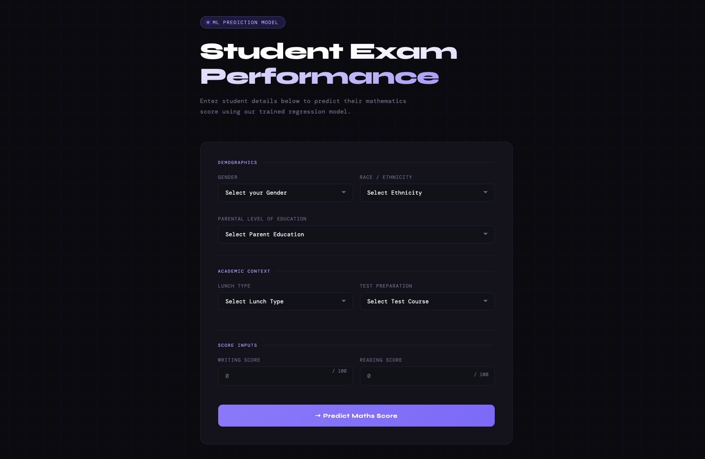

# end-to-end-ml-pipeline with deployment

A full end-to-end machine learning web application that predicts a student's **mathematics score** based on demographic and academic factors.

**Live Demo → [student-performance-ml.azurewebsites.net](https://ml-student-predictor-deaqemb3efa2auge.francecentral-01.azurewebsites.net/)**

> ⚠️ Hosted on Azure Free tier — the app may take 20-30 seconds to load on first visit as the server wakes up from sleep. Please be patient!

---



---

## Features

- Predicts student math scores using 7 input features
- Trained and evaluated on 7 regression models with hyperparameter tuning via GridSearchCV
- Best model automatically selected based on R² score (achieved **0.88** on test set)
- Clean modular ML pipeline (ingestion → transformation → training)
- Flask web app with a modern dark UI
- Deployed on **Azure App Service** with CI/CD via GitHub Actions
- Unit and integration tests via pytest (7 tests, 100% passing)

---

## ML Pipeline

```
Raw Data (CSV)
    ↓
Data Ingestion        → splits into train/test (80/20), saves to artifacts/
    ↓
Data Transformation   → handles missing values, encodes categories, scales features
    ↓
Model Training        → trains 7 models with GridSearchCV, saves best model
    ↓
Predict Pipeline      → loads saved model, returns prediction
    ↓
Flask Web App         → serves prediction via UI
```

---

## Models Evaluated

| Model | Description |
|---|---|
| Linear Regression | Baseline model — best performer (R²: 0.88) |
| Decision Tree | Tree-based model |
| Random Forest | Ensemble bagging |
| Gradient Boosting | Sequential ensemble |
| XGBoost | Optimized gradient boosting |
| CatBoost | Categorical boosting |
| AdaBoost | Adaptive boosting |

> Best model is selected automatically based on R² score on the test set.

---

## Results

| Metric | Value |
|---|---|
| Best Model | Linear Regression |
| Test R² | 0.8804 |
| Train R² | 0.8743 |
| Dataset size | 1,000 samples |
| Train/Test split | 80/20 |

---

## Tech Stack

**ML & Data**
- Python, Pandas, NumPy
- Scikit-learn, XGBoost, CatBoost
- Dill (model serialization)

**Web**
- Flask
- HTML/CSS (custom dark UI)

**DevOps**
- GitHub Actions (CI/CD)
- Azure App Service (deployment)

**Testing**
- pytest (unit and integration tests)

---

## Run Locally

### Prerequisites

```bash
# Mac only — required for XGBoost
brew install libomp
```

### Setup

```bash
# Clone the repo
git clone https://github.com/AfaqueFarooq/end-to-end-ml-pipeline.git
cd end-to-end-ml-pipeline

# Create and activate virtual environment
python3.12 -m venv venv
source venv/bin/activate

# Install dependencies
pip install -r requirements.txt
```

### Train the model

```bash
python src/pipeline/train_pipeline.py
```

### Run the app

```bash
python application.py
```

### Run tests

```bash
pytest tests/ -v
```

---

## Deployment

This project is deployed on **Azure App Service** with automatic deployments triggered on every push to `main` via GitHub Actions.
